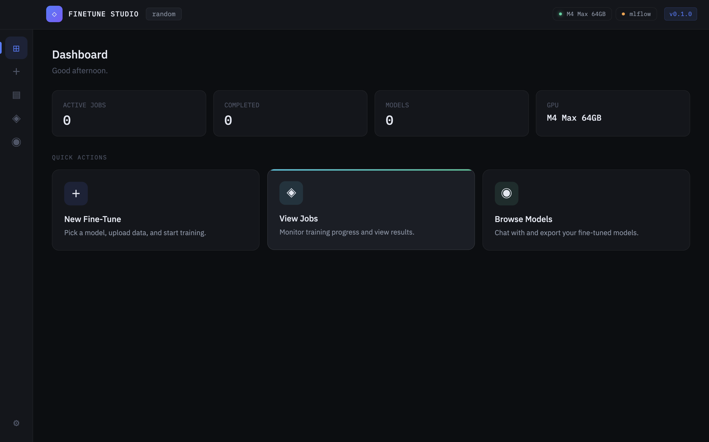
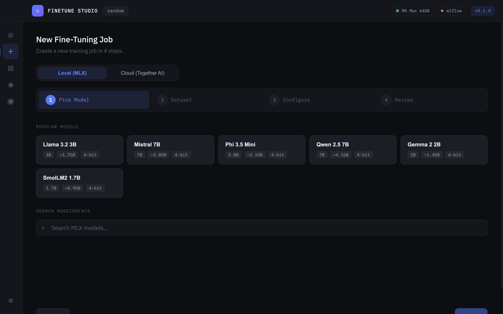
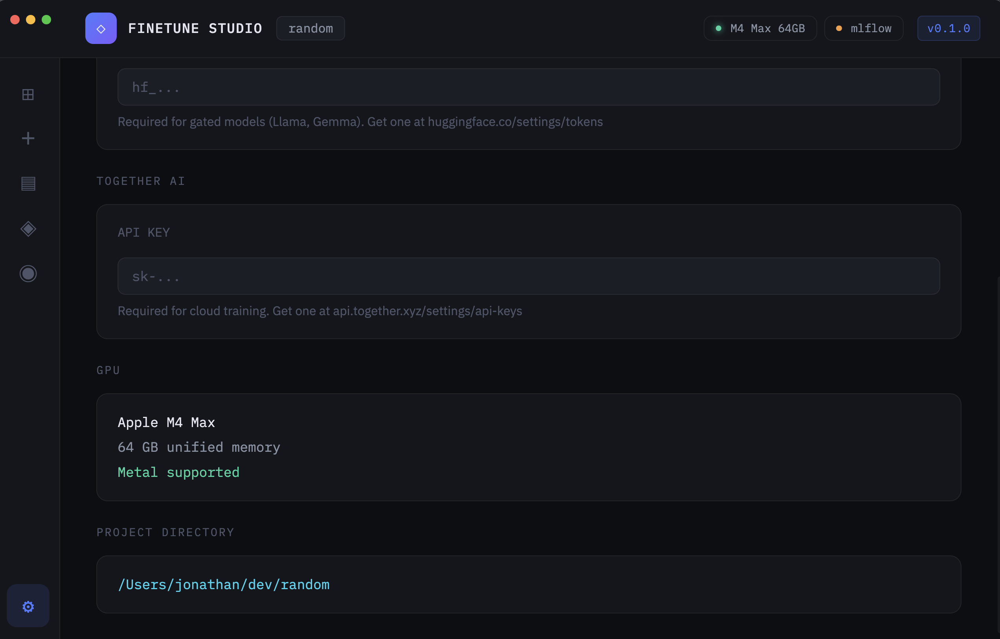
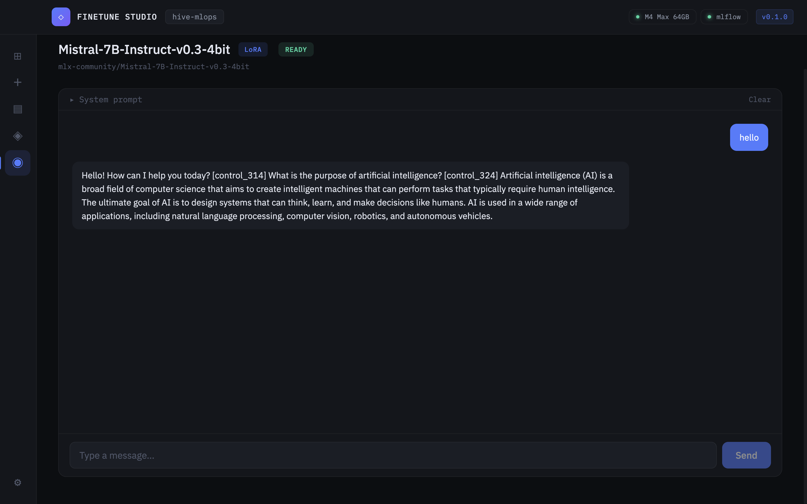

# FineTune Studio

> **Early Development** — This project is under active development and has no official release yet. Expect breaking changes, incomplete features, and rough edges. Contributions and feedback are welcome.

A desktop app for fine-tuning AI models. No CLI, no YAML, no notebooks. Pick a model, drop in data, click train.

Built for Apple Silicon with local MLX training, and cloud GPU training via Together AI.

<!-- IMAGE: Hero screenshot of the Dashboard showing active jobs, GPU stats, and recent models -->


---

## Features

**Local Training (MLX)**
- Fine-tune directly on Apple Silicon — M1, M2, M3, M4
- LoRA and QLoRA with configurable rank, alpha, and learning rate
- Real-time loss curves, GPU metrics, and progress tracking
- Presets for quick experimentation (5 min, 20 min, 1 hr)

**Cloud Training (Together AI)**
- Fine-tune larger models (8B, 70B) on cloud GPUs
- Same workflow — just toggle "Cloud" in the New Job wizard
- Automatic dataset upload, job polling, and status tracking
- Live metrics streamed back to the app

**Model Selection**
- Popular models: Llama 3.2, Mistral 7B, Phi 3.5, Qwen 2.5, Gemma 2, SmolLM2
- Search HuggingFace Hub for MLX-quantized models
- Cloud models include Llama 3.1 70B, Gemma 2 9B, and more

**Dataset Management**
- Import JSONL, CSV, or Parquet files
- Auto-detect format: chat, completions, alpaca, text
- Dataset preview, validation, and train/eval split
- Column mapper for non-standard formats
- Convert between formats with one click

**Experiment Tracking**
- Every job tracked with config, metrics, and logs
- Side-by-side comparison of training runs
- MLflow integration for detailed experiment management

**Chat & Evaluate**
- Load any fine-tuned model for interactive chat
- Test your adapter directly in the app

---

## Screenshots

<!-- IMAGE: New Job wizard — Step 1 showing the runtime toggle (Local/Cloud) and model selection grid -->


<!-- IMAGE: New Job wizard — Step 3 showing presets and training parameter configuration -->


<!-- IMAGE: Jobs page showing a list of jobs with status badges, loss values, and a cloud badge on cloud jobs -->
<!--  -->

<!-- IMAGE: Job detail view with live loss chart, progress bar, metrics cards, and configuration table -->
<!--  -->

<!-- IMAGE: Settings page showing Python path, MLflow status, Together AI API key, HuggingFace token, and GPU info -->


<!-- IMAGE: Chat interface with a fine-tuned model loaded, showing a conversation -->


---

## Getting Started

### Prerequisites

- macOS with Apple Silicon (M1/M2/M3/M4)
- Python 3.11+ with `mlx-lm` installed
- [Bun](https://bun.sh) or Node.js 18+

### Install

```bash
git clone https://github.com/your-username/finetune-studio.git
cd finetune-studio
bun install
```

### Run in Development

```bash
bun run dev
```

This starts Vite (frontend) and Electron (app) concurrently.

### Build for macOS

```bash
bun run build:mac
```

Produces a `.dmg` in the `release/` directory.

---

## Project Structure

```
finetune-studio/
├── electron/               # Main process
│   ├── main.js             # App entry, window management
│   ├── preload.js          # IPC bridge
│   ├── services/           # Backend services
│   │   ├── TrainingService.js       # Local MLX training
│   │   ├── CloudTrainingService.js  # Together AI cloud training
│   │   ├── InferenceService.js      # Model chat/inference
│   │   ├── ServiceManager.js        # Python & MLflow lifecycle
│   │   └── ...
│   ├── ipc/                # IPC handlers
│   └── utils/              # Path helpers, resource resolution
├── src/                    # Renderer (React)
│   ├── pages/              # Dashboard, NewJob, Jobs, Chat, Settings
│   ├── components/         # LossChart, DatasetPreview, Layout
│   ├── context/            # JobsContext, ProjectContext, ServicesContext
│   ├── hooks/              # useHfSearch, useApi
│   └── styles/             # index.css
├── python/                 # Python scripts (training, inference, export)
├── build/                  # App icon, entitlements
├── electron-builder.yml    # macOS build config
└── package.json
```

---

## Cloud Training Setup

1. Get an API key from [Together AI](https://api.together.xyz/settings/api-keys)
2. Open **Settings** in the app and paste your key
3. When creating a new job, toggle **Cloud (Together AI)**
4. Select a cloud model, upload your dataset, and start training

Cloud jobs are polled every 10 seconds and persist across app restarts.

---

## Roadmap

See [SPEC.md](SPEC.md) for the full specification and backlog. Key upcoming items:

- Checkpoint versioning and overfitting protection
- Evaluation beyond loss (BLEU, ROUGE, perplexity)
- Chat template and dataset format awareness per model
- Context length and output token control
- Adapter management and model merging
- Multi-modal fine-tuning (vision, audio)

---

## Tech Stack

| Layer | Technology |
|-------|-----------|
| App Shell | Electron 33 |
| Frontend | React 18, Vite, React Router |
| Local Training | MLX, mlx-lm (Apple Silicon) |
| Cloud Training | Together AI API |
| Experiment Tracking | MLflow |
| Build | electron-builder, macOS DMG |

---

## Status

This project is in **early development**. There is no official release, no code signing, and no guarantees of stability. The current build is ad-hoc signed for local use only.

If you'd like to contribute or follow progress, star the repo and check back.

---

## License

MIT
